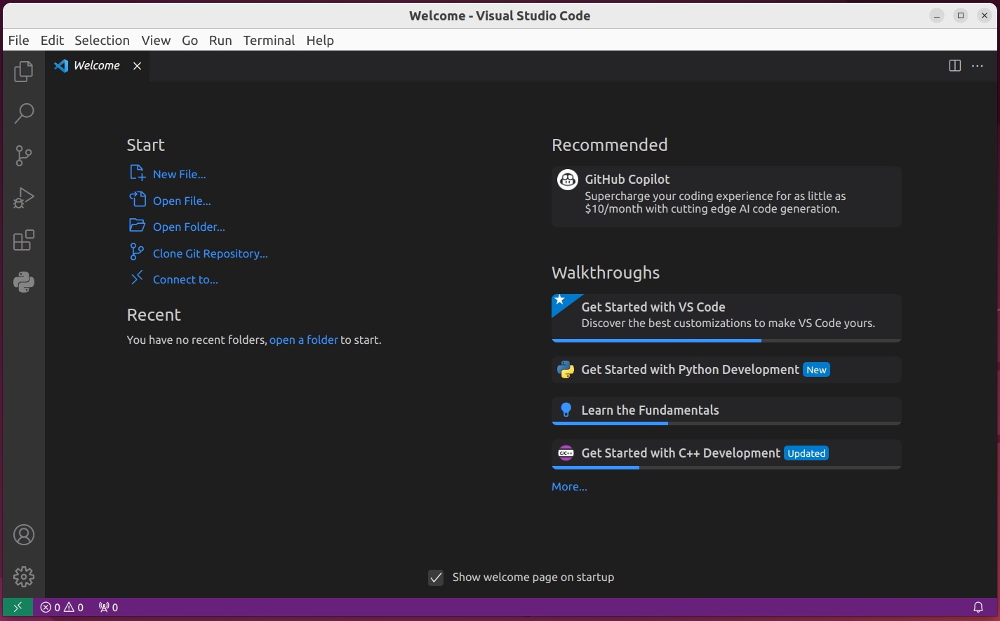

**Debugging Zephyr PSoC™ 6 programs with VSCode – Version 0.1**

**Components**

**Hardware**

| **Name**                                                                                                                              | **Quantity** |
| ------------------------------------------------------------------------------------------------------------------------------------- | ------------ |
| [INFINEON PSoC6-BLE Pioneer Kit](https://www.cypress.com/documentation/development-kitsboards/psoc-6-ble-pioneer-kit-cy8ckit-062-ble) | 1 or         |
| [INFINEON CY8CPROTO-062-4343W](https://www.infineon.com/cms/en/product/evaluation-boards/cy8cproto-062-4343w/)                        | 1 or         |
| [INFINEON CY8CPROTO-063-BLE](https://www.infineon.com/cms/en/product/evaluation-boards/cy8cproto-063-ble/)                            | 1            |
|                                                                                                                                       |              |

**Software**

<table>
<thead>
<tr class="header">
<th><strong>Name</strong></th>
<th><strong>Quantity</strong></th>
</tr>
</thead>
<tbody>
<tr class="odd">
<td><a href="https://releases.ubuntu.com/jammy/">Ubuntu 22.04 Desktop Image</a></td>
<td>1</td>
</tr>
<tr class="even">
<td><a href="https://docs.zephyrproject.org/latest/develop/getting_started/index.html">Zephyr Getting Started</a></td>
<td>1</td>
</tr>
<tr class="odd">
<td><a href="https://docs.zephyrproject.org/latest/develop/toolchains/zephyr_sdk.html#toolchain-zephyr-sdk">Zephyr Software Development Kit (SDK)</a></td>
<td>1</td>
</tr>
<tr class="even">
<td><p><a href="https://github.com/Infineon/openocd">Infineon Customized OpenOCD</a></p>
<p><a href="https://github.com/Infineon/training-modustoolbox">ModusToolbox</a> (optional, includes Infineon’s OpenOCD)</p></td>
<td><p>1</p>
<p>1</p></td>
</tr>
<tr class="odd">
<td><p>hal_infineon Binary Blobs (see instructions)</p>
<p><a href="https://code.visualstudio.com/download">VSCode</a></p>
<p><a href="https://github.com/lawrencek52/vscode-infineon-psoc6-openocd">VSCode setup files</a></p></td>
<td><p>1</p>
<p>1</p>
<p>1</p></td>
</tr>
</tbody>
</table>

**Description**

This project outlines the steps needed to start symbolic debugging of
Zephyr programs in the VSCode IDE.

This project was developed under Ubuntu Linux, and has not been tested
on OSX or Windows development platforms, however it should work on these
platforms with minor modifications.

**Installing the Zephyr RTOS and development system**

Follow the steps at
<https://docs.zephyrproject.org/latest/develop/getting_started/index.html>.
This will setup your base Zephyr development system. The base includes
necessary tools (cmake, python, devicetree compiler), and the necessary
cross compiler (Zephyr SDK).

Note: I installed my Zephyr SDK at $HOME/.local/zephyr-sdk-0.16.1. If
you elect one of the other options then you may need to edit the paths
in settings.json with the appropriate path.

**Installing necessary Infineon extensions**

Once the standard zephyr development is setup you need a couple of
Infineon specific additions. These are described in the zephyr
documentation specific to your board. In my case I am using the
CY8CPROTO-062-4343W board and the instructions are here:
<https://docs.zephyrproject.org/latest/boards/arm/cy8cproto_062_4343w/doc/index.html>

Execute the command

```
west blobs fetch hal\_infineon
```

Install the Infineon version of openocd, by executing the following
commands:

```
mkdir -p \~/.local/bin
cd \~/.local/bin
wget https://github.com/Infineon/openocd/releases/download/release-v5.0.0/openocd-5.0.0.2401-linux.tar.gz
tar -vxzf openocd-5.0.0.2401-linux.tar.gz
rm openocd-5.0.0.2401-linux.tar.gz
```

**Some Handy Programs**

I have found that terminal programs like putty, and teraterm often have
difficulties when you connect and disconnect boards. I like the terminal
program ‘tio’ for its simplicity. It defaults to the most common serial
settings of 115,200, and 8N1 so there is no need to change these
defaults.

```
sudo apt install tio
sudo apt install apt-transport-https
```

We will use tio later to monitor the serial output from the board.

If at some point in the future you update vscode with sudo apt upgrade
you will need the apt-transport-https utility.

**Creating a new sample program**

To get started we will build a reasonably complex sample program, the
Bluetooth observer. I will build my samples in the Documents directory.

```
cd \~/Documents
cp -r \~/zephyrproject/zephyr/samples/bluetooth/observer bluetooth\_observer
cd bluetooth\_observer
west build -b cy8cproto\_062\_4343w
west flash --openocd \~/.local/bin/openocd/bin/openocd
tio /dev/ttyACM0
```

At this point tio should display the Bluetooth devices that the observer
has seen nearby. Since tio started after the program started, you may
not see the Booting message, simply press the reset switch on the board
and restart the program, or you can open a second terminal window and
leave tio running in it all the time. Here is what I see:

```
[tio 17:20:26] tio v1.32
[tio 17:20:26] Press ctrl-t q to quit
[tio 17:20:26] Connected
*** Booting Zephyr OS build zephyr-v3.4.0-1843-g68ee177a01f3 ***
Starting Observer Demo
Started scanning...
Exiting main thread.
Device found: 29:3D:1A:7B:A0:58 (random) (RSSI -51), type 3, AD data len 31
Device found: DE:59:87:F3:7A:D6 (random) (RSSI -86), type 0, AD data len 14
Device found: 58:E7:BF:72:DF:C9 (random) (RSSI -89), type 3, AD data len 31
Device found: 3D:7A:30:68:C9:E1 (random) (RSSI -69), type 3, AD data len 31
Device found: 78:F8:F8:E7:F0:08 (random) (RSSI -84), type 2, AD data len 28
Device found: F1:97:F3:14:25:CC (random) (RSSI -92), type 0, AD data len 21
Device found: 49:09:09:72:99:09 (random) (RSSI -93), type 2, AD data len 28
Device found: 4A:0A:0A:AA:D3:EF (random) (RSSI -94), type 2, AD data len 28
Device found: 76:85:FC:7F:2F:41 (random) (RSSI -98), type 2, AD data len 28
Device found: 78:E3:6D:8E:8D:5E (public) (RSSI -95), type 0, AD data len 19
```

So far we have installed zephyr, the zephyr SDK, and we have tested that
we can build a complex program, load it to the board, and see results
being produced. Now it’s time to move from command line development to
an IDE with symbolic debugging.

**Installing VSCode**

To install the VSCode, download the .deb file for your architecture
(x64, Arm32, arm64) from here: <https://code.visualstudio.com/download>.
The download is quite large (\~92MB) so it may take a while to download.

Then install VSCode deb package with the commands:

```
cd ~/Downloads
sudo apt install ./code_1.82.1-1694163687_amd64.deb
```

Note the version you download will most likely be different than 1.82.1,
change the version information to match what you downloaded. Once you
have installed from the .deb file all future updates and re-installs can
be done by running the following commands:

```
sudo apt update
sudo apt install code
```

**Adding VSCode configurations to the sample project**

Before starting VSCode and opening the bluetooth\_observer project we
want to add some vscode configuration information to the observer
sample. The configuration information will be in the .vscode
subdirectory of \~/Documents/bluetooth\_observer.

Fetch the vscode settings from github:

```
cd ~/Documents
git clone https://github.com/lawrencek52/vscode\-infineon-psoc6-openocd.git
```

then copy the appropriate files into the .vscode subdirectory of
\~/Documents/bluetooth\_observer. Use the following commands.

```
cd ~/Documents/vscode-infineon-psoc6-openocd
cp -r .vscode ~/Documents/bluetooth_observer/
```

**Starting VSCode and open the sample program**

Start VSCode. You should have an icon like this in your applications
tray. Since you will be using VSCode for development a lot it is
probably a good idea to right click the icon and add it to your
favorites list.


After starting VSCode you will see the IDE:



Open the bluetooth-observer by clicking “Open Folder” on the start menu,
and selecting the directory Documents/bluetooth\_observer.

**Compile and start debugging the sample program**

From the menu bar at the top of the VSCode window select Run-\>Start
Debugging, or press F5. This will compile your sample program, load it
to the board, and run to the entry point of main(). Finally, VSCode will
display the code from main.c with the next line of code to be executed.

**Starting the sample program**

Before starting the sample program we need a terminal to monitor the
serial output from the board. From the menu bar at the top of the VSCode
window select Terminal-\>New Terminal, this will open a new terminal
window at the bottom of the VSCode and show a bash command prompt. Start
the tio program to monitor the serial output from the board:

```
tio /dev/ttyACM0
```

tio will start and connect to the board, typical output from tio is:

```
[tio 12:09:17] tio v1.32
[tio 12:09:17] Press ctrl-t q to quit
[tio 12:09:17] Connected
```

Now start the program by pressing the “play” icon in the top center of
the VSCode window. The tio will display the output from the sample
program, this is what I see:

```
lawrence@Ubuntu22:\~/Documents/bluetooth\_observer$ tio /dev/ttyACM0

[tio 12:13:42] tio v1.32
[tio 12:13:42] Press ctrl-t q to quit
[tio 12:13:42] Connected
Starting Observer Demo
Started scanning...
Exiting main thread.
Device found: 27:5C:81:09:95:71 (random) (RSSI -75), type 3, AD data len 31
Device found: 2B:BF:B8:75:CE:EB (random) (RSSI -39), type 3, AD data len 31
Device found: F1:97:F3:14:25:CC (random) (RSSI -92), type 0, AD data len 21
Device found: CC:F4:11:86:2C:D9 (public) (RSSI -92), type 2, AD data len 28
Device found: 11:F9:8E:8F:AA:20 (random) (RSSI -93), type 3, AD data len 31
Device found: 44:05:A5:41:72:9A (random) (RSSI -98), type 2, AD data len 28
Device found: 6D:AD:AD:E2:EA:D5 (random) (RSSI -70), type 2, AD data len 28
Device found: 7F:7F:FF:7E:76:F1 (random) (RSSI -92), type 2, AD data len 28
Device found: CD:9D:FC:15:9A:FE (random) (RSSI -83), type 3, AD data len 8
```

**Adding breakpoints**

At this point you can explore adding breakpoints, single stepping
through code and examining the state of variables. In general, most of
the time the sample program will be in cpu\_idle.S waiting for Bluetooth
activity. Explore and enjoy….

**Notes:**

I have only tested these instructions on an Ubuntu 22.04 system. There
are hooks for running under Windows, but I haven’t tested them.

There are 3 boards listed, and the Bluetooth observer should work on all
of them, but has only been tested on the CY8CPROTO-062-4343W board.

There are a few paths coded into the VSCode settings. I tried to move
most of them into the settings.json file, but I may have missed one or
two.

Feel free to send me a pull request or patch if you find errors in the
various json files or in my instructions. I will be happy to update
things as necessary.

```
https://github.com/lawrencek52/vscode-infineon-psoc6-openocd
```
